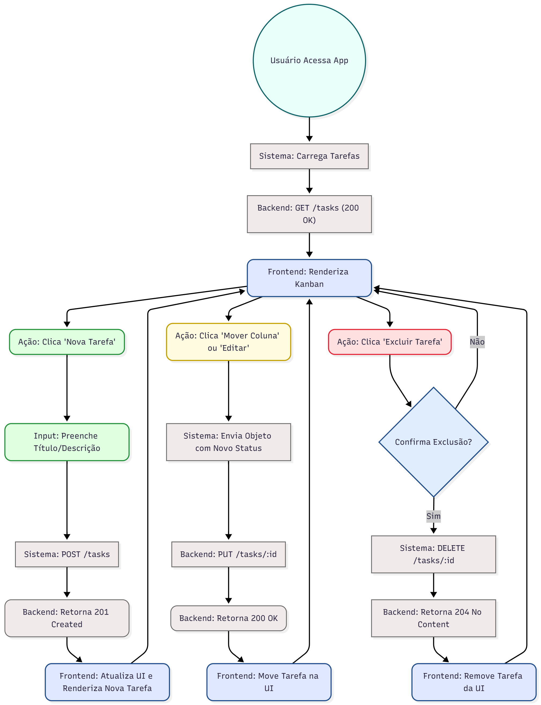

# 🚀 Desafio Fullstack - Aplicação Kanban

Este projeto implementa um sistema simples de gerenciamento de tarefas estilo Kanban, dividido em duas partes: um Backend robusto em Go (Golang) e um Frontend dinâmico desenvolvido com React e Vite.

---

## 💻 Tecnologias Utilizadas

| Componente | Tecnologia | Descrição |
| :--- | :--- | :--- |
| **Backend** | **Go (Golang)** | API REST full responsável pela lógica de negócios e persistência de dados em memória, utilizando o framework `go-chi/chi`. |
| **Frontend** | **React & Vite** | Interface do usuário (UI) para visualizar e interagir com o quadro Kanban. O Vite foi escolhido para o setup rápido. |
| **Documentação** | **Draw.io** | Diagrama de fluxo de usuário para mapear a interação do Frontend com o Backend. |

---

## 🛠️ Funcionalidades da API (Backend - Go)

O backend Go expõe endpoints RESTful para o gerenciamento completo das tarefas (CRUD):

| Método | Endpoint | Descrição | Status de Sucesso |
| :--- | :--- | :--- | :--- |
| `GET` | `/tasks` | Retorna todas as tarefas. | `200 OK` |
| `POST` | `/tasks` | Cria uma nova tarefa. | `201 Created` |
| `PUT` | `/tasks/{id}` | Atualiza uma tarefa existente por ID. | `200 OK` |
| `DELETE` | `/tasks/{id}` | Remove uma tarefa por ID. | `204 No Content` |

**Nota:** A aplicação salva os dados em memória. As tarefas são perdidas ao reiniciar o servidor Go.

})
